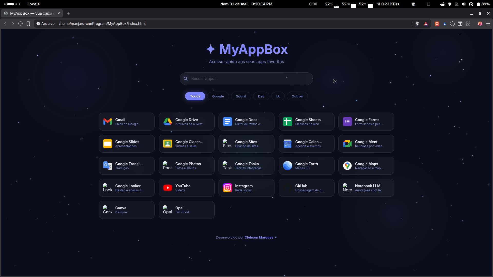

# MyAppBox — Seu portal de acesso rápido



O **MyAppBox** é um dashboard elegante e minimalista projetado para organizar seus aplicativos e serviços favoritos em um só lugar. Com um visual cósmico e interações fluidas, ele oferece uma experiência de navegação moderna e intuitiva.

## ✨ Principais Funcionalidades

- **Busca Híbrida 🔍**: Digite para filtrar seus apps locais instantaneamente. Se não encontrar o que deseja, pressione **Enter** para realizar uma busca direta no Google em uma nova aba.
- **Sistema de Filtros 🏷️**: Organize seus aplicativos por categorias (Google, Social, Dev, IA, Outros) e encontre o que precisa em um clique.
- **Experiência Imersiva 🌌**:
  - Fundo dinâmico com estrelas cadentes e nebulosas geradas em Canvas.
  - Rastro do mouse ultra-suave com interpolação de movimento.
  - Efeito de profundidade (Tilt 3D) e iluminação dinâmica nos cards.
- **Responsivo**: Adaptado para diferentes resoluções de tela.

## 🚀 Como usar

1. **Clonar/Baixar**: Copie os arquivos do projeto para sua máquina.
2. **Abrir**: Basta abrir o arquivo `index.html` em qualquer navegador moderno.
3. **Atalhos**: 
   - Pressione `/` para focar rapidamente no campo de busca.
   - Pressione `Esc` para limpar a busca e resetar os filtros.

## 🛠️ Tecnologias Utilizadas

- **HTML5**: Estrutura semântica dos cards e layout.
- **CSS3**: Variáveis de cor, animações personalizadas, efeitos de Glassmorphism e layout Flex/Grid.
- **JavaScript (Vanilla)**: Lógica do canvas, interpolação geométrica para o rastro do mouse, motores de filtro e busca.

## 📂 Estrutura do Repositório

- `index.html`: Estrutura principal e lista de aplicativos.
- `style.css`: Toda a identidade visual e efeitos de animação.
- `script.js`: "Cérebro" do projeto (Canvas, Busca, Interface).
- `image (2).png`: Screenshot para o README.

## 🎨 Personalização

Para adicionar novos aplicativos, basta inserir um novo bloco no `index.html` seguindo este padrão:

```html
<div class="card" data-name="Nome do App" data-category="ia">
    
    <div class="card-info">
        <h3>Nome do App</h3>
        <p>Breve descrição</p>
    </div>
</div>
```

---

Desenvolvido com foco em estética e performance por **Clebson Marques**. 🌌✨
